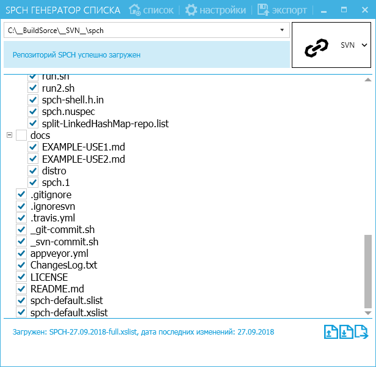
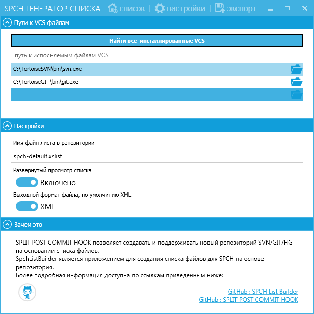

# Spch List Builder

`Spch List Builder` is an application for creating a list of files for the SPCH based on the repository.

`SPLIT POST COMMIT HOOK` - `spch`: allows you to create and maintain a new SVN/GIT/HG repository based on the file list.

 - [latest download](https://ci.appveyor.com/project/ClnViewer/spchlistbuilder/build/artifacts)
 - [zip archive NET 4.0](https://ci.appveyor.com/api/buildjobs/0so13a4rjwdbyy8j/artifacts/Metro%2Fbin%2FSpchListBuilder.zip)
 - [nuget archive NET 4.0](https://ci.appveyor.com/api/buildjobs/0so13a4rjwdbyy8j/artifacts/SpchListBuilder.1.0.15.nupkg)

More information is available on the links below:

 - [Split post commit Hook :: Home](https://github.com/ClnViewer/Split-post-commit-Hook---SVN-GIT-HG)

## License

_MIT_

